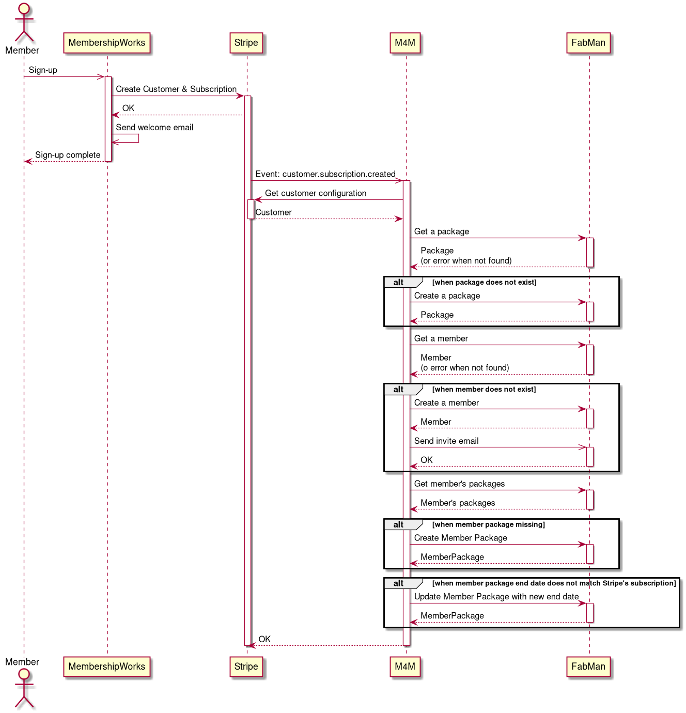

# Marineholmen Makerspace Members Management

System used by Marineholmen Makerspace to automatically manage members in FabMan based on their subscription configured in Stripe (through MembershipWorks).

# How does it work?

Following is the flow diagram for new members sign-up.

M4M executes the same flow also for the following Stripe events:
- customer.subscription.trial_will_end
- customer.subscription.updated

This will ensure that we keep member's subscription always up to date.